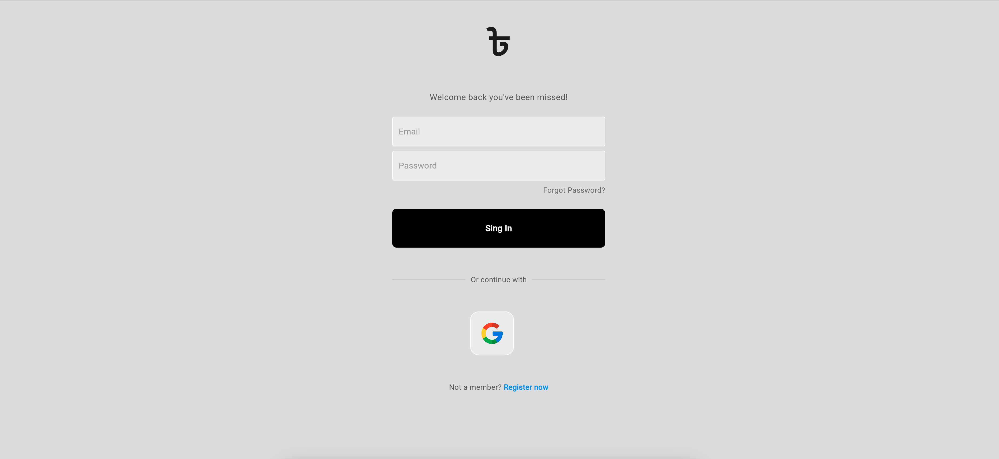
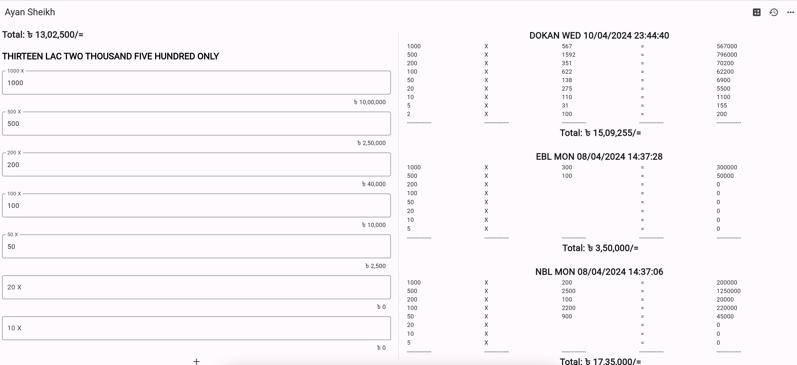

# MoneyCount App

MoneyCount is a Firebase-based web and mobile application designed to help users count and manage their money easily. Users can input different denominations of currency notes, view the total amount in both numerical and word form, save their calculations, and access their transaction history.

## Features

- Count money in various denominations (e.g., 1000, 500, 200, 100, etc.).
- View the total amount in both numerical and word form.
- Save calculations for future reference.
- Access transaction history.

## Accessing the App

### Web Version

You can access the web version of MoneyCount by visiting [https://moneycountbd.web.app/](https://moneycountbd.web.app/).

### Mobile Version

MoneyCount is also available on the Google Play Store. You can download it [here](https://play.google.com/store/apps/details?id=com.moneycountbd).

## Usage

1. **Login**: Users can log in using their email or Google account.
2. **Input Money**: Enter the count of different denominations of currency notes.
3. **View Total**: See the total amount calculated in both numerical and word form.
4. **Save**: Save the calculation for future reference.
5. **View History**: Access your transaction history to track past calculations.

## Screenshots

## Contributing

Contributions are welcome! If you have any suggestions or find any issues, feel free to open an issue or create a pull request.

## License

This project is licensed under the MIT License. See the [LICENSE](LICENSE) file for details.
